# GacCollection

前几年仿照火车头开发的采集工具,用于学习和熟悉爬虫

付出了很多努力,最终未能修成正果

代码一直在电脑中吃灰,本着无私奉献的精神

免费开源,给有需要的人参考和完善

## 已实现功能

-   任务新建和编辑
-   网址采集
-   标签编辑
-   数据采集
-   数据发布
-   发布配置的修改,编辑和测试
-   发布模块的修改和编辑

## 界面预览

放一些预览图片

运行效果

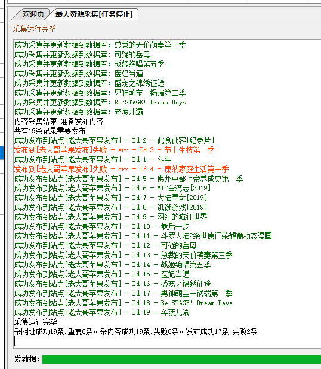

主界面

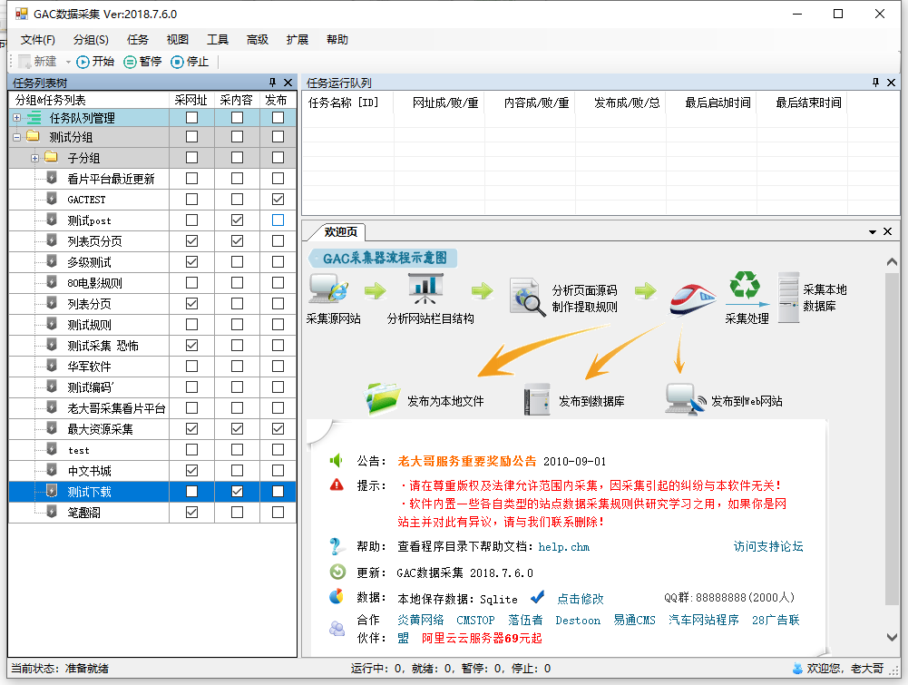

任务窗口

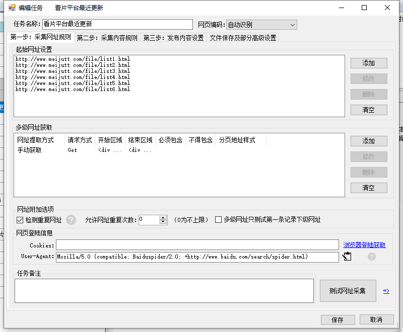

采集内容

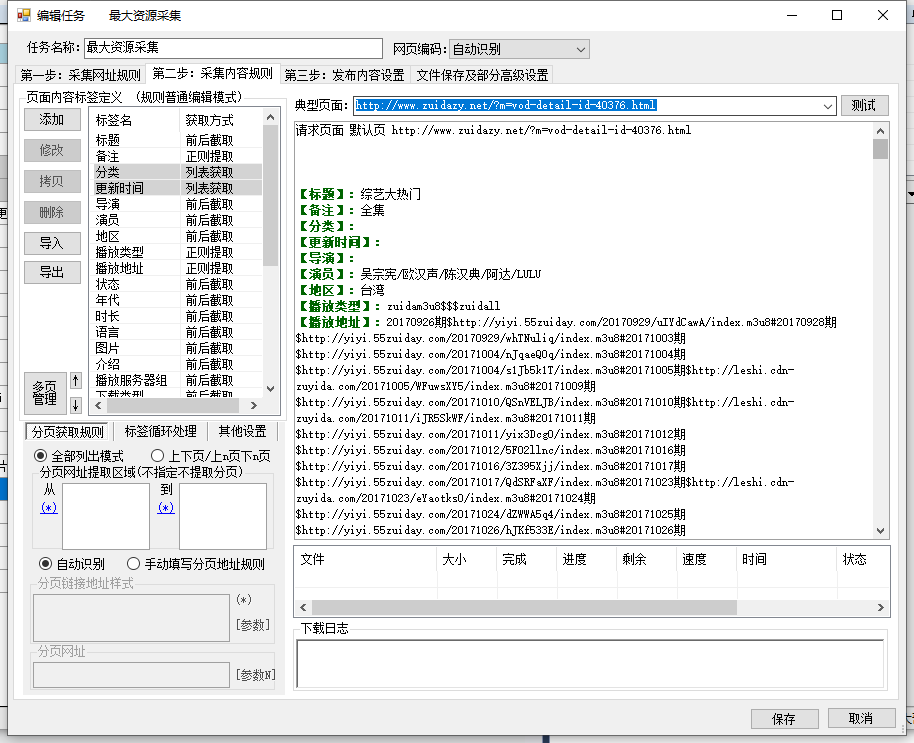

网址采集

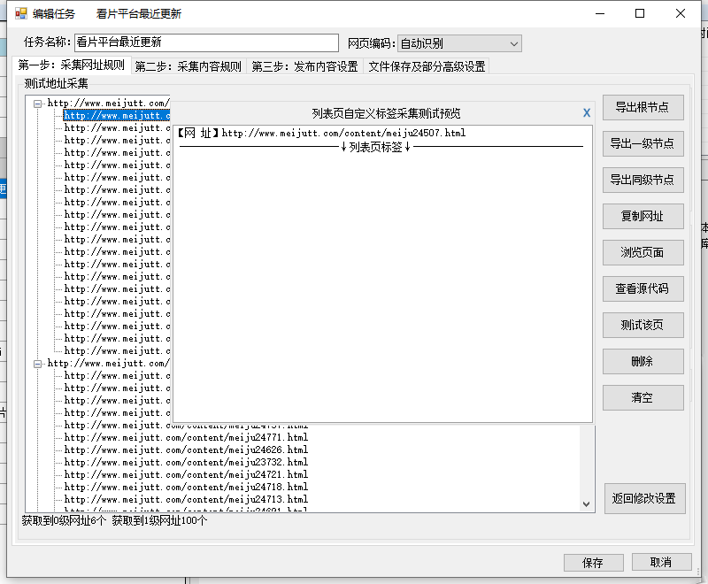

发布选择

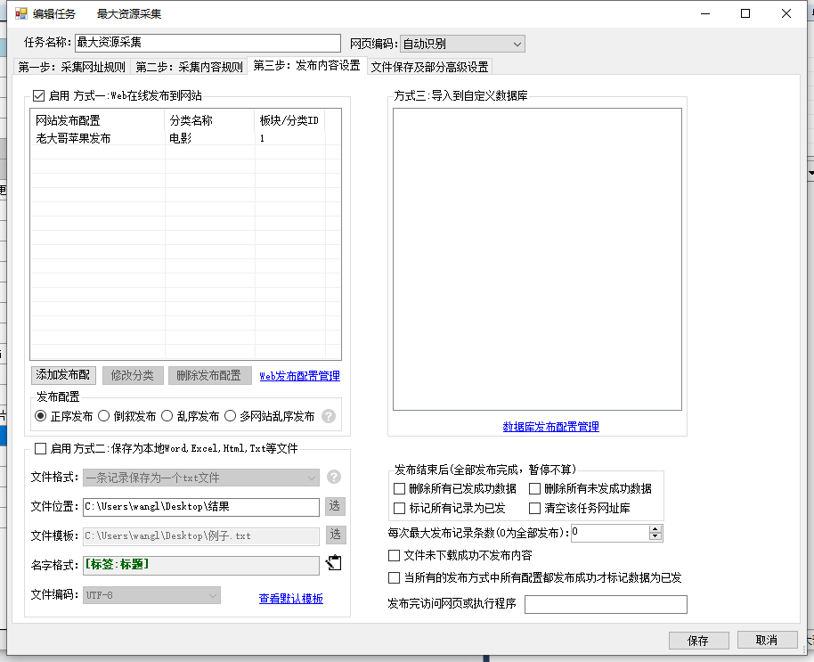

多级网址采集

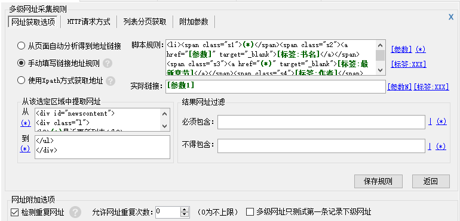

浏览器获取信息

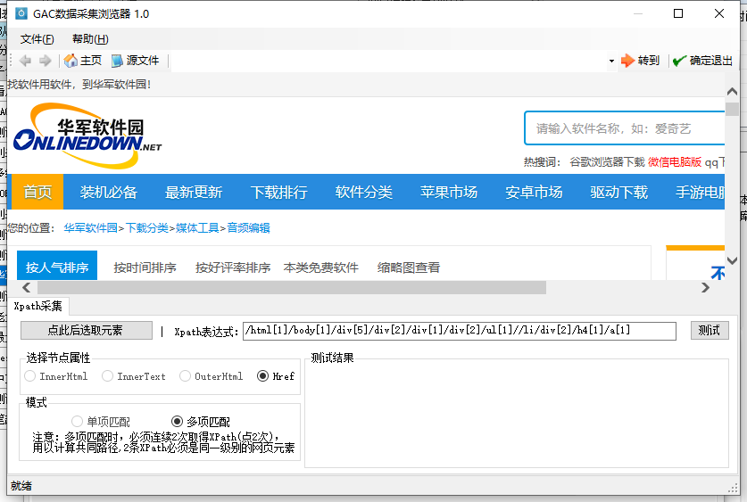

标签编辑

PS:这个部分耗时醉酒

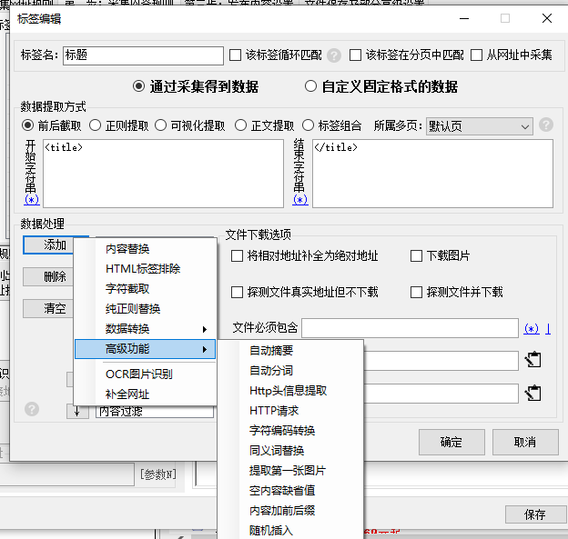

发布配置

**接下来是发布部分**

发布模块

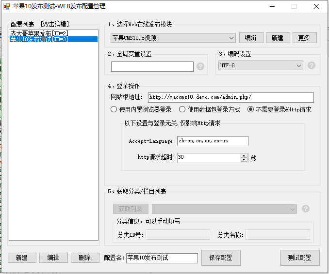

发布模块配置

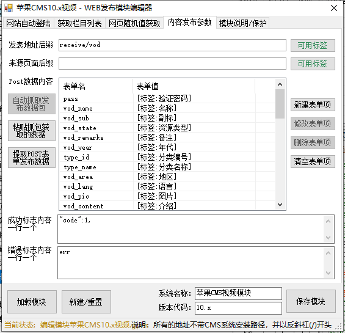

发布测试

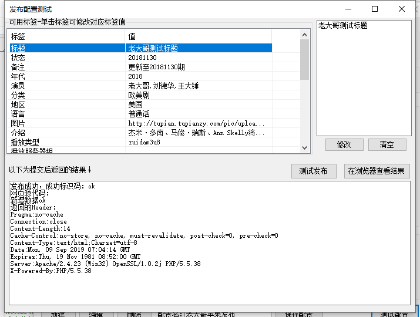

## 引用开源产品

.Net Docking Library for Windows Forms，HttpHelper，Quartz 等等

## 开发记录

2018-05-23

-   [窗口]主界面布局
-   [窗口]信息提示窗口

2018-05-24

-   [窗口]任务分组列表
-   [新增]任务列表实现保存和读取
-   [优化]主界面窗口尺寸自适应完善

2018-05-25

-   [新增]分组增加，删除以及修改功能实现，已 xml 文本形式保存文件

2018-05-26

-   [优化]分组增删改重写，改用 sqlite3

2018-05-27

-   [窗口]采集任务第一步布局
-   [窗口]动态提醒帮助窗口
-   [控件]PicMenu——菜单选择改变文本框
-   [窗口]网址添加(半成品)

2018-05-28

-   [控件]高亮显示编辑框
-   [控件]lable——选项修改代码框
-   [窗口]添加采集地址添加窗口布局完成
-   [新增]网址添加部分各个规则生成预览完成

2018-05-29

-   [优化]重新优化代码高亮编辑框，更多属性和配置，更多展现组合方式
-   [新增]任务编辑基本信息读取(标题，备注等)
-   [窗口]多页管理窗口布局完成
-   [新增]多页管理网址替换和源码中提取

2018-05-30

-   [新增]GAC 浏览器支持 Xpath，可视化选取采集元素，支持多选和单选，网址自动纠正

2018-05-31

-   [窗口]添加任务第一步全部布局完成(尺寸自适应)
-   [新增]通过 xpath 获取网址
-   [优化]代码高亮，支持 post 随机值和分页
-   [代码]新增获取规则网址列表(待测试)

2018-06-1

-   [窗口]第一步读取配置信息完成
-   [新增]多级网址规则增删改
-   [新增]POST 参数增删改
-   [新增]自动获取网址链接
-   [新增]手动获取网址链接
-   [新增]GET 和 POST 方式获取链接

2018-06-2

[新增]多级网址支持标签

-   [新增]支持附加参数
-   [新增]列表分页获取
-   [核心]获取网址列表(一级网址)

2018-06-3

-   [新增]获取网址列表支持 Xpath
-   [新增]测试地址采集结果，实时状态
-   [新增]测试结果的导出，复制，浏览
-   [新增]获取网址列表支持多级
-   [新增]检测重复网址
-   [新增]多级网址只测试第一级
-   [新增]网址列表结果支持标签
-   [优化]浏览器获取 cookies 自动跳转第一个网址

2018-06-4 至 2018-06-9

暂停开发六天

2018-06-10

-   [优化]网址采集支持多级标签
-   [布局]新建任务第三步布局完成

2018-06-12

-   16[辅助]xml 生成实体类工具开发

2018-06-17

暂停一天

2018-06-18

-   [窗口]多页管理实现

2018-06-19

-   [窗口]标签编辑基本布局

2018-06-20

-   [新增]标签处理列表读取

2018-06-21 至 2018-06-22

-   [优化]部分标签处理编辑

2018-06-24

-   [优化]除 ocr 外所有标签读取编辑保存
-   [优化]固定格式读取，测试

后面懒得写了 😂 分页采集 拼音处理 翻译 开发细节 多页名称禁用 分页\d

2018-07-06

-   [修复]支持多页保存
-   [新增]支持新增标签
-   [优化]新建任务自带标签
-   [优化]制作启动欢迎页,改用本地文件,避免突然失效
-   [优化]添加多级网址采集部分的标签存在检测和标签不存在检测

2018-07-07

-   [修复]规则没有默认值引起的错误
-   [修复]批量多页导入没有解码
-   [新增]起始网址支持编辑

2018-07-08

-   [优化]保存任务时的各种参数赋值
-   [修复]编辑任务时多级网址不存在而引发的错误

2018-07-09

-   [新增]支持任务新增和保存
-   [修复]修复添加标签处理时覆盖旧的处理
-   [优化]保存最近测试的网址

2018-07-12

-   [优化]任务编辑界面循环匹配换行功能
-   [修复]标签不存在引起的错误
-   [修复]多次保存任务导致的重复编码问题
-   [修复]单条起始网址无法编辑的问题
-   [修复]没有多级网址无法获取网址列表的问题

2018-07-15

-   [新增]循环标签添加为新记录,循环不足第一条记录补齐
-   [优化]标签编辑中保存文件名,保存目录和系统时间高亮显示
-   [修复]循环获取和非循环获取同时存在时的逻辑

2018-07-16

-   [优化]将标签测试代码移植到类中,方便后期调用
-   [新增]标签下载的各项功能实现

2018-07-17

-   [新增]下载部分布局
-   [优化]重写 http 请求全部代码,实现代理功能
-   [优化]增加默认页重试

2018-07-18

-   [新增]增加标签保留字段,禁止用户使用
-   [优化]重写网址爬取,实现类中爬取网址
-   [新增]实现列表标签
-   [新增]实现标签排序
-   [新增]支持开始任务,结束任务
-   [新增]支持任务抓取网址
-   [优化]禁止关闭欢迎窗口
-   [优化]采集网址进度展示
-   [优化]开启任务或结束任务时判断是否已存在

2018-07-19 至 2018-02-21

-   [新增]实现数据库转换功能
-   [优化]支持 access,sqlite,mysql,sqlserver

2018-07-25

-   [新增]实现采集网址,统计网址数量
-   [新增]实现采集待采集单条内容,录入更新至数据库
-   [修复]保存任务,任务状态丢失
-   [修复]标签自动获取内容选项具体配置丢失
-   [优化]提升控件速度
-   [修复]多次开始并停止内容时注册多次事件
-   [优化]每次开始任务时重新读取配置

2018-07-26

-   [修复]固定标签内容为空
-   [新增]标签结果检测
-   [新增]内容多线程采集

2018-07-27

-   [优化]实现标签的内容过滤(标签不得为空,包含,不得包含,重复检测,长度判断等)
-   [优化]实现一个网址多条结果的采集并录入数据库
-   [新增]实现采集完成后提示

2018-10-06

-   [修复]网址自定义规则存在多个标签时的错误
-   [优化]保存存在错误时,自动跳转对应界面
-   [修复]匹配时可能会有多种换行符的问题
-   [修复]采集网址时支持填写多个标签
-   [修复]采集网址时自动增减标签
-   [新增]增加标签名导出功能

2018-10-09

-   [新增]支持文件发布
-   [优化]过滤保存文件时路径或文件名包含特殊字符
-   [优化]实现发布时进度条
-   [新增]支持设置发布状态,发布成功自动标注(支持全部成功才标记)
-   [新增]支持全部标记为已发和未发

2018-10-24

-   [新增]新增数据发布配置界面布局

2018-11-26

-   [新增]发布模块配置界面
-   [新增]支持加载发布模块
-   [新增]新增点选菜单控件
-   [优化]代码框支持插入标签

2018-11-27

-   [优化]支持新增和修改发布模块
-   [优化]支持带有密码的火车头模块和 GAC 模块
-   [优化]发布配置支持读取模块列表,支持点击编辑模块

2018-11-29

-   [优化]发布配置管理支持读取数据库中的配置
-   [优化]可以通过微型浏览器获取 cookies
-   [优化]发布配置可以修改和保存
-   [优化]重写发布配置方面 XML 操作方式
-   [优化]重写发布模块的 XML 读写方式

2018-11-30

-   [优化]支持编辑和删除发布配置信息
-   [新增]webpost 可测试发布
-   [新增]支持测试发布模块和配置
-   [优化]测试标签自动保存,方便下次测试
-   [优化]登陆后的 cookies 进行保存
-   [优化]发布模块支持导入,导出,删除至此,发布模块编辑,发布配置全部完毕

2018-12-01

-   [新增]规则编辑支持导入发布模块中的标签
-   [新增]规则编辑支持添加发布配置,删除,修改配置

2018-12-03

-   [新增]支持测试页面测试 web 发布
-   [优化]修改 web 发布,迎合通用发布接口,使其可以实现正常发布内容
-   [修复]列表标签编辑后成为标签的 bug
-   [优化]优化必须包含和不得包含返回结果,迎合测试日志

2018-12-21

-   [优化]修改采集规则和标签规则迎合插件
-   [优化]修改下载列表迎合插件
-   [优化]修改采集迎合插件

2018-12-24

-   [优化]迎合插件合并网址采集和内容采集
-   [修复]采集网址列表时,范围不支持(\*)的 bug
-   [优化]迎合插件重写采集网址部分

2019-01-07

-   [修复]多个多级网址,会让列表标签消失
-   [修复]无法取消插件选择的情况
-   [优化]迎合插件网址获取结果改为 List<KeyValuePair<string, Dictionary<string, string>>>
-   [修复]采集网址时,不是最后一层也入库的情况
-   [修复]未勾选采内容依旧采集内容的情况
-   [修复]列表标签多级继承
